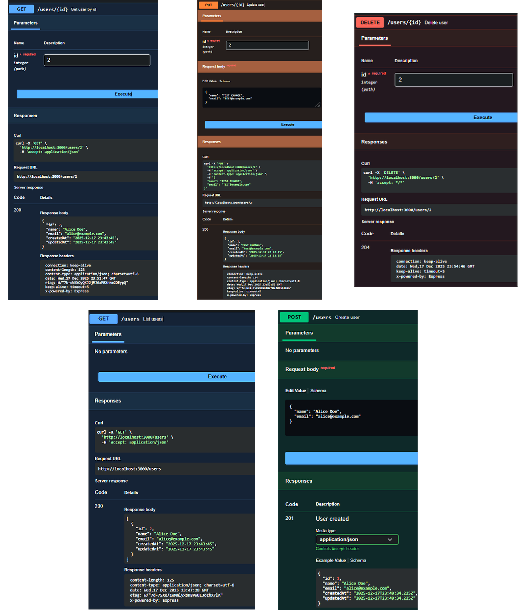
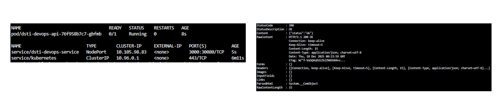

# DevOps Project

## Work performed
- User CRUD API with SQLite persistence, /health probe, and Swagger UI at /docs.
- SQLite bootstrap on startup; default DB at userapi/data.sqlite unless DB_PATH is set.
- Jest + supertest tests for DB helpers, model validation, and HTTP endpoints.
- Multi-stage Dockerfile with curl-based healthcheck; Docker Compose stack with persistent volume.
- IaC: Vagrant + Ansible provisioning Node 20, SQLite, npm deps, and systemd service.
- Kubernetes deployment with PVC/PV for SQLite, probes, and NodePort service.

## Prerequisites
- Node.js 20+, npm
- Docker (and optionally Docker Hub account to push images)
- Vagrant + VirtualBox + Ansible
- kubectl + cluster (tested with minikube)

## Local install & run
From repo root:
```
cd userapi
npm ci
npm start
```
- API: http://localhost:3000
- Health: http://localhost:3000/health
- Docs:   http://localhost:3000/docs


Environment:
- PORT (default 3000)
- DB_PATH (default userapi/data.sqlite)

## Tests
```
cd userapi
npm test
```

## Docker

### Local build and run
From the root of the repository:
```sh
docker build -t dsti-devops:local -f userapi/Dockerfile userapi
docker run --rm -p 3000:3000 -e DB_PATH=/data/data.sqlite -v dsti-devops-data:/data dsti-devops:local
curl http://localhost:3000/health
```
- The application will be accessible at http://localhost:3000
- SQLite data is persisted in the `dsti-devops-data` volume

## Docker Compose
```
docker-compose up --build
curl http://localhost:3000/health
```
Compose uses the api-data volume to persist SQLite at /data/data.sqlite.

## Vagrant + Ansible
From the iac/ folder:
```
cd iac
vagrant up
vagrant ssh
systemctl status dsti-devops
curl http://localhost:3000/health
```
Provision installs Node 20 + SQLite, runs 
pm ci in /vagrant/userapi, and starts systemd service dsti-devops pointing to src/index.js.

## Kubernetes (minikube)
```
minikube start
minikube -p minikube docker-env --shell powershell | Invoke-Expression
docker build -t dsti-devops:latest -f .\userapi\Dockerfile .\userapi

kubectl apply -f k8s/pv-pvc.yaml
kubectl apply -f k8s/deployment.yaml
kubectl apply -f k8s/service.yaml

kubectl get pods,svc
kubectl port-forward svc/dsti-devops-service 3000:3000
curl http://localhost:3000/health
```
Notes:
- Always run the build command from the repository root so the `userapi` path is found. On macOS/Linux you can use `docker build -t dsti-devops:latest -f userapi/Dockerfile userapi`.
- If you push to Docker Hub instead of building inside minikube, update `k8s/deployment.yaml` image to your namespace and run `kubectl apply -f k8s/`.

PVC stores SQLite data at /mnt/data/dsti-devops. Service exposes NodePort 30080.

## Screenshots
- API docs: 
- Kubernetes resources: 

## Repository file tree

```
dsti_devops
    ├── .github
    │   └── workflows
    │       └── blank.yml
    ├── iac
    │   ├── playbooks
    │   │   └── site.yml
    │   └── Vagrantfile
    ├── image
    │   ├── api_docs
    │   │   ├── others
    │   │   │   ├── delete_data.png
    │   │   │   ├── get_all.png
    │   │   │   ├── get_id.png
    │   │   │   ├── post_add.png
    │   │   │   └── put_update.png
    │   │   └── api_endpoints.png
    │   └── kubernetes
    │       └── kubernetes_health_overview.png
    ├── k8s
    │   ├── deployment.yaml
    │   ├── pv-pvc.yaml
    │   └── service.yaml
    ├── userapi
    │   ├── conf
    │   │   └── .env.example
    │   ├── src
    │   │   ├── models
    │   │   │   └── userModel.js
    │   │   ├── repositories
    │   │   │   └── userRepository.js
    │   │   ├── routes
    │   │   │   └── users.js
    │   │   ├── app.js
    │   │   ├── database.js
    │   │   ├── index.js
    │   │   └── swagger.js
    │   ├── test
    │   │   ├── database.test.js
    │   │   ├── userModel.test.js
    │   │   └── users.api.test.js
    │   ├── .dockerignore
    │   ├── Dockerfile
    │   ├── package-lock.json
    │   └── package.json
    ├── .gitignore
    ├── docker-compose.yaml
    ├── project.md
    └── README.md

```

## Author
Lucky12348

## AI usage
For general questions, use Mistral. For code generation and assistance with fixing code, use GitHub Copilot.
